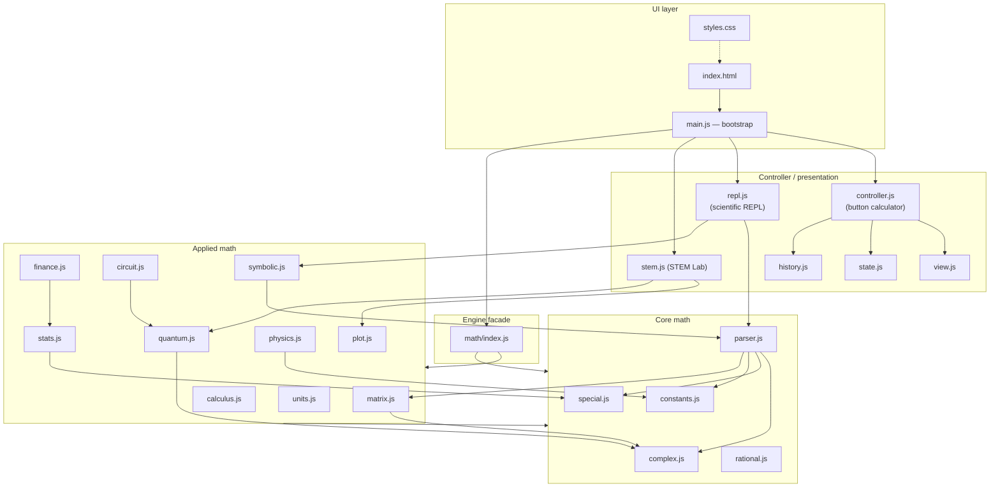
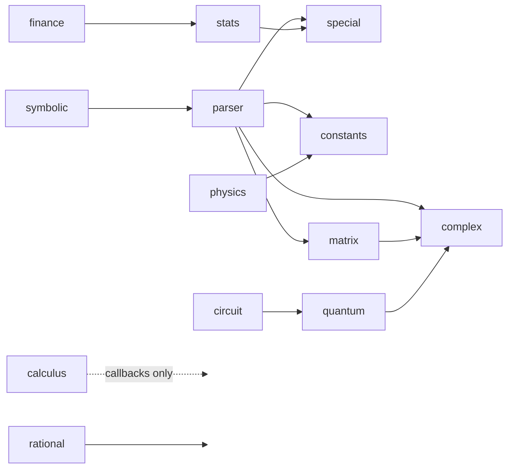
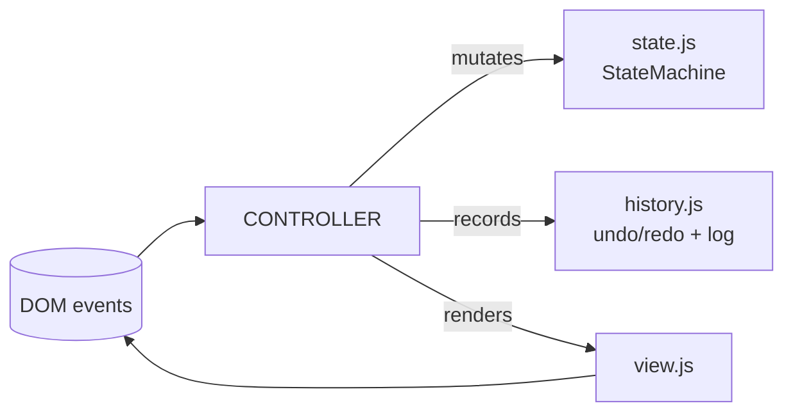

# Architecture

This document describes the structure of the Professional Calculator scientific
engine: its layers, the module dependency graph, runtime data flow, and the
design decisions behind them.

> Diagrams use [Mermaid](https://mermaid.js.org/); GitHub renders them inline.

---

## 1. Design goals

| Goal | How it's met |
|---|---|
| **Numerics independent of the DOM** | All of `math/` is pure functions over plain values — no DOM, no globals, no I/O. It runs identically in Node and the browser. |
| **Correctness you can audit** | Every routine has a closed-form test anchor. No "trust me" numerics. |
| **No injection surface** | The expression engine is a hand-written parser + tree-walking evaluator. No `eval`, no `Function`. |
| **Zero runtime dependencies** | Only dev tooling (jest, typescript). Nothing ships to the user. |
| **No build step** | Native ES modules + JSDoc types checked by `tsc`. Ship the source. |
| **Progressive** | The 4-function button calculator works even if the engine modules fail to load (lazy import, graceful degradation). |

---

## 2. Layered architecture



**Dependency rule:** edges only point downward. Core math depends on nothing in
the project; applied math depends only on core; the facade depends on both; the
presentation layer depends on the facade; the UI wires it together. There are no
cycles.

---

## 3. Module dependency graph (math only)



- `complex`, `rational`, `constants` are **leaves** (no internal deps).
- `quantum` builds on `complex`; `circuit` is a fluent builder over `quantum`.
- `physics` reads `constants`; `symbolic` walks the `parser` AST; `plot` is
  dependency-free pure geometry.
- `parser` now also depends on `matrix` for the matrix/vector literal grammar.
- `special` is a leaf used by `stats`, `finance`, and `parser`.
- `calculus` takes plain `(x:number)=>number` callbacks, so it is decoupled from
  every other module — anything that produces a function can drive it.
- `index.js` re-exports all of the above behind namespaces.

---

## 4. Runtime data flow — expression evaluation

```mermaid
sequenceDiagram
    participant U as User
    participant R as repl.js
    participant P as parser.tokenize/parse
    participant E as parser.evaluate
    participant C as complex.js
    U->>R: types "2 + 3i" + Enter
    R->>R: detect assignment? (no)
    R->>P: parse("2 + 3i")
    P->>P: tokenize → [num, op, num, name(i)]
    P->>P: Pratt parse → AST (binary +)
    P-->>R: AST
    R->>E: evaluate(AST, scope)
    E->>C: add({re:2,im:0}, {re:0,im:3})
    C-->>E: {re:2, im:3}
    E-->>R: {re:2, im:3}
    R->>R: format → "2 + 3i"; scope.ans = result
    R-->>U: render log entry
```

Assignment (`x = expr`) is detected at the REPL layer by a regex before parsing,
because `=` is not part of the expression grammar. The RHS is evaluated in the
current scope and bound to the name.

---

## 5. The button calculator (MVC)

The original 4-function calculator is a clean MVC triad, independent of the
engine:



- **`state.js`** — an explicit finite-state machine (`idle → entering →
  operator_set → …`) with a frozen transition table; illegal transitions are
  rejected.
- **`history.js`** — a `CircularBuffer` (O(1) push/pop) backing undo, a separate
  redo stack (invalidated on new input), and a completed-calculation log for the
  sidebar.
- **`view.js`** — the only module that touches calculator DOM; a single shared
  ARIA live region announces results.

See [DATA_MODEL.md](DATA_MODEL.md) for the state diagram and entity model.

---

## 6. Key design decisions

### 6.1 Pratt parser over shunting-yard or PEG
Precedence climbing (Pratt) gives correct precedence and associativity with a
tiny, readable recursive-descent core, and makes right-associative `^` and
postfix `!` trivial. No parser-generator dependency.

### 6.2 Everything complex
The evaluator computes over ℂ uniformly; reals are `{re, im:0}`. This means
`sqrt(-4)` just works (`2i`) without special-casing, and the same code serves
real and complex inputs. The UI collapses `im≈0` back to a real for display.

### 6.3 Jacobi for symmetric, QR for general eigenproblems
Symmetric matrices use cyclic Jacobi — simple, robust, and it yields orthonormal
eigenvectors for free. General matrices reduce to Hessenberg form then run
shifted QR to a real Schur form, reading eigenvalues from 1×1 and 2×2 diagonal
blocks (the 2×2 blocks produce complex-conjugate pairs).

### 6.4 Exact rationals via BigInt
`rational.js` keeps `n/d` in lowest terms with `gcd` normalization, so
`0.1 + 0.2` is exactly `3/10`. Integer powers stay exact to arbitrary size.

### 6.5 Dimensional analysis as a safeguard
`units.js` represents quantities as a magnitude plus a 7-vector of SI base
exponents. Addition requires equal dimensions; multiplication adds exponents.
This is the check that rejects `3 kg + 2 m`.

### 6.6 Lazy-loaded engine, graceful degradation
`main.js` boots the button calculator synchronously, then `import()`s the engine
asynchronously. If the engine fails to load, the calculator still works and the
REPL shows a friendly error.

---

## 7. Error handling strategy

| Layer | Strategy |
|---|---|
| Core math | Throw typed errors (`RangeError`, `TypeError`, `SyntaxError`, `ReferenceError`) with precise messages. Pure — never swallow. |
| Parser | `SyntaxError` with character positions; `ReferenceError` for unknown symbols/functions. |
| REPL | Catches all throws and renders them as log entries — never crashes the page. |
| Calculator controller | Each operation wrapped in an error boundary; errors surface as a typed display state with auto-recovery. |

---

## 8. Why no framework

The entire UI is ~3 small controllers over the DOM. A framework would add a
build step, a runtime dependency, and bundle weight for no functional gain. The
engine is the value; the UI is a thin, accessible shell. Native ES modules give
us code-splitting (`import()`), and `tsc` gives us types — without webpack/vite.
