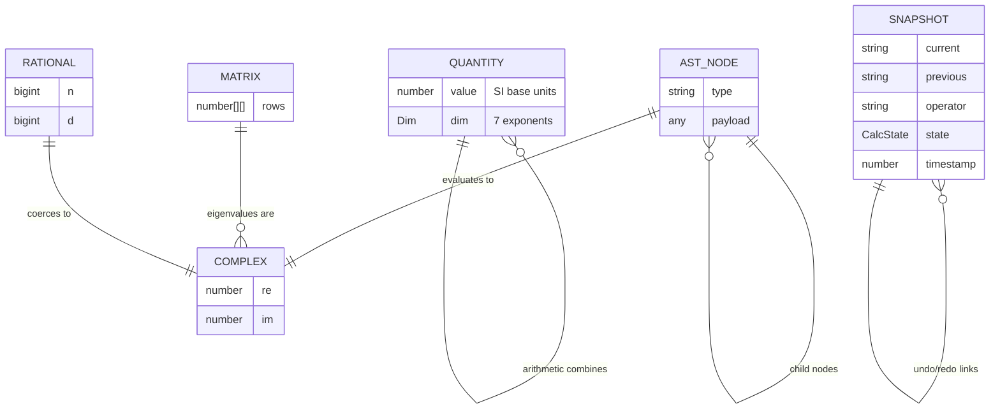
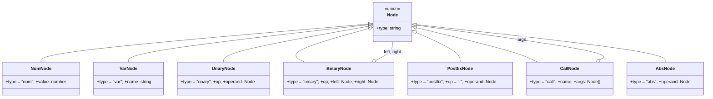
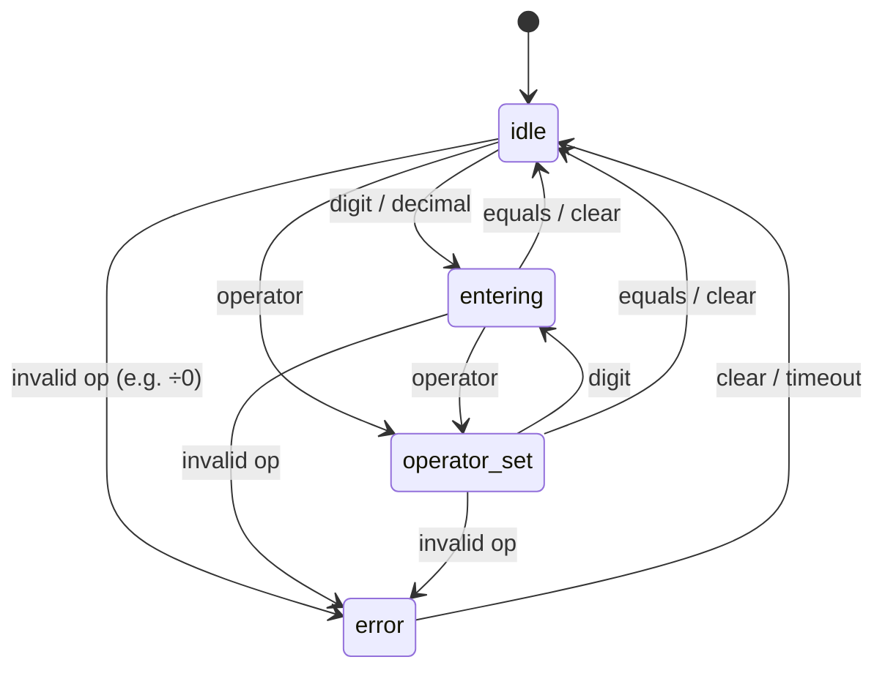
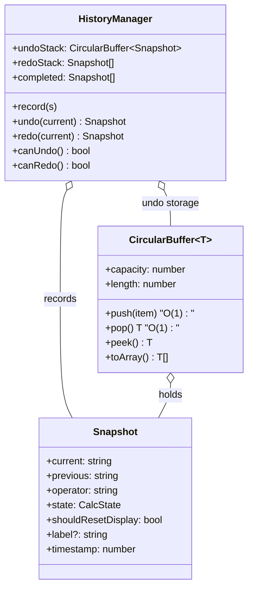

# Data & Domain Model

A calculator has no database, so there is no SQL ERD in the traditional sense.
What it *does* have is a well-defined set of **domain entities** (the value types
the engine computes with) and **relationships** between them, plus the explicit
**state machine** that governs the interactive calculator. This document models
all three: an entity-relationship view, a class/type view, and the state model.

> "ERP" (Enterprise Resource Planning) is not applicable to a calculator — it is
> a business-operations discipline, not a software artifact. The relevant
> modeling here is **ERM/ERD** (entity-relationship) of the domain types, which
> follows.

---

## 1. Entity-relationship diagram (domain value types)



### Entity catalog

| Entity | Defined in | Shape | Invariants |
|---|---|---|---|
| **Complex** | `complex.js` | `{ re, im }` | immutable; reals are `im === 0` |
| **Rational** | `rational.js` | `{ n: bigint, d: bigint }` | `d > 0`, `gcd(\|n\|, d) = 1` |
| **Matrix** | `matrix.js` | `number[][]` row-major | rectangular |
| **Quantity** | `units.js` | `{ value, dim: number[7] }` | `value` in SI base units |
| **AST Node** | `parser.js` | tagged union (`num`/`var`/`binary`/…) | tree, no cycles |
| **Snapshot** | `history.js` | calculator state record | part of undo/redo chain |
| **PhysicalConstant** | `constants.js` | `{ value, unit, symbol, name, exact }` | read-only |

---

## 2. AST node type hierarchy

The parser produces a tagged-union AST. Each variant and its evaluation:



| Node | Evaluates by |
|---|---|
| `num` | wrap as `{re: value, im: 0}` |
| `var` | scope lookup → imaginary unit → constant → `ReferenceError` |
| `unary` | negate or identity |
| `binary` | `+ − × ÷ ^ %` over ℂ |
| `postfix` | factorial (`n!` integer, else `Γ(n+1)`) |
| `call` | dispatch: complex fns → real fns → multi-arg special forms |
| `abs` | modulus `|z|` |

---

## 3. Calculator state machine

The button calculator is governed by an explicit FSM with a frozen transition
table (`state.js`). Illegal transitions are rejected at runtime.



| From \ To | idle | entering | operator_set | error |
|---|:---:|:---:|:---:|:---:|
| **idle** | — | ✅ | ✅ | ✅ |
| **entering** | ✅ | — | ✅ | ✅ |
| **operator_set** | ✅ | ✅ | — | ✅ |
| **error** | ✅ | ❌ | ❌ | — |

`restore()` bypasses validation (used only when replaying a previously-valid
snapshot during undo/redo).

---

## 4. History / undo-redo model



**Semantics**

- `record(s)` pushes onto the undo buffer and **clears the redo stack** (a new
  action invalidates the redo future — standard editor behavior).
- `undo(current)` pops the undo buffer and pushes `current` onto redo.
- `redo(current)` pops redo and pushes `current` back onto undo.
- `completed` is a separate, capped, newest-first log for the sidebar — distinct
  from the step-back stack.

---

## 5. Units dimensional model

A `Quantity` is a magnitude in SI base units plus an exponent vector over the
seven SI base dimensions:

```
dim = [ mass, length, time, current, temperature, amount, luminosity ]
```

| Quantity | dim vector | Reads as |
|---|---|---|
| velocity | `[0, 1, −1, 0, 0, 0, 0]` | m·s⁻¹ |
| force (N) | `[1, 1, −2, 0, 0, 0, 0]` | kg·m·s⁻² |
| energy (J) | `[1, 2, −2, 0, 0, 0, 0]` | kg·m²·s⁻² |
| power (W) | `[1, 2, −3, 0, 0, 0, 0]` | kg·m²·s⁻³ |

Arithmetic rules: `+`/`−` require equal dim; `×` adds dims; `÷` subtracts dims;
`^k` scales dims by `k`. Conversion is `SI = value·factor + shift`, where `shift`
is non-zero only for affine temperature scales (°C, °F).
